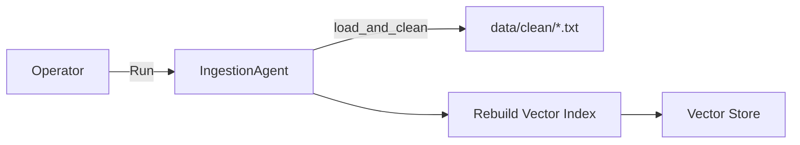
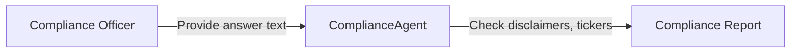
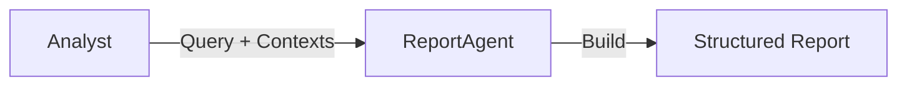
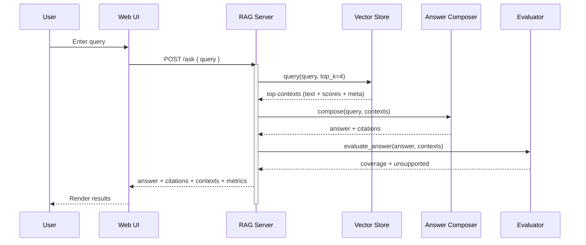

# Finance RAG & Agent MVP — End‑to‑End Documentation

This document explains the project from end to end, including the main use cases, system architecture, data flow, tools/technologies, and how each part works together. Diagrams use Mermaid for readability.

## 1) Goal and Scope
- Provide a minimal, dependency‑free Retrieval‑Augmented Generation (RAG) demo for financial texts with basic evaluation.
- Offer scaffolding for future enhancements: LoRA fine‑tuning, agents (ingestion/compliance/reporting), monitoring, API, and a simple web dashboard.

Primary stages:
1. Stage 1 — Offline RAG MVP (runs with Python stdlib, no external packages).
2. Stage 2 — Fine‑tuning stub (LoRA/PEFT scaffolding).
3. Stage 3 — Agents (ingestion, compliance, reporting).
4. Stage 4 — API server + monitoring stubs, plus a local dashboard.

## 2) Key Use Cases

### 2.1 End‑User Queries via Dashboard
```mermaid
flowchart LR
  U[End User] -->|Types query| UI[Web UI]
  UI -->|POST /ask| API[RAG HTTP Server]
  API --> RAG[RAG Pipeline]
  RAG --> VS[Vector Store (TF-IDF)]
  VS --> RAG
  RAG --> LLM[Answer Composer]
  LLM --> RAG
  RAG --> API
  API --> UI
  UI -->|Shows| OUT[Answer + Citations + Metrics + Contexts]
```

### 2.2 Ingestion Refresh (Agent)


### 2.3 Compliance Check (Agent)


### 2.4 Report Generation (Agent)


## 3) System Architecture

```mermaid
graph TD
  subgraph Client
    UI[Web UI (public/index.html)]
  end

  subgraph Server
    S[HTTP Server (src/server/rag_server.py)]
    PIPE[RagPipeline (src/rag/pipeline.py)]
    VS[DocumentStore (TF-IDF) (src/rag/vector_store.py)]
    CH[Chunker (src/rag/chunker.py)]
    LLM[LocalAnswerComposer (src/llm/local.py)]
    EVAL[Evaluator (src/eval/metrics.py)]
  end

  subgraph Data
    RAW[data/raw/*.txt]
    CLEAN[data/clean/*.txt]
  end

  UI -->|/ask| S
  S --> PIPE
  PIPE --> VS
  PIPE --> LLM
  S --> EVAL
  RAW -->|load_and_clean| CLEAN
  CLEAN -->|fit (chunk+index)| VS
```

Notes
- Replace LocalAnswerComposer with `OllamaAnswerer` (src/llm/ollama_client.py) to use a local LLM via Ollama.
- The vector store is a simple TF‑IDF implementation using Python stdlib only.

## 4) Data Flow (Stage 1)



## 5) Components and Responsibilities

- Data Loader (src/data/loader.py)
  - Reads `data/raw/*.txt`, normalizes whitespace, writes `data/clean/*.txt`.
  - Returns in‑memory list of documents (path, content).

- Chunker (src/rag/chunker.py)
  - Splits text into overlapping word windows (size=600, overlap=80 by default).

- Vector Store (src/rag/vector_store.py)
  - Minimal tokenizer, smoothed IDF, sparse cosine similarity.
  - Indexes per‑chunk TF‑IDF vectors and returns top‑k contexts.

- RAG Pipeline (src/rag/pipeline.py)
  - Orchestrates retrieval and answer composition; formats contexts/citations.

- Answer Composer
  - Local deterministic composer (src/llm/local.py): picks high‑overlap sentences from retrieved text to minimize hallucinations.
  - Optional Ollama integration (src/llm/ollama_client.py): prompts a local model with the contexts and citation rules.

- Evaluator (src/eval/metrics.py)
  - support_coverage: token overlap with sources.
  - unsupported_sentences: flags low‑overlap sentences (heuristic).

- Server + UI
  - HTTP server (src/server/rag_server.py): serves dashboard and handles `/ask`.
  - Web UI (public/index.html): simple form, results display, metrics, contexts.

- Agents (stubs)
  - IngestionAgent (src/agents/ingestion_agent.py): refresh cleaned data and re‑index.
  - ComplianceAgent (src/agents/compliance_agent.py): disclaimer/ticker checks.
  - ReportAgent (src/agents/report_agent.py): build structured summaries.

- Training Stub (src/train/lora_finetune_stub.py)
  - Prints planned LoRA/PEFT steps; integrate with HF Transformers later.

- Monitoring & API Stubs
  - MetricsStub (src/monitoring/metrics_stub.py): counters/timings snapshot.
  - API stub (src/server/api_stub.py): toy endpoints and usage counter.

## 6) Tools and Technologies

- Language/Runtime: Python 3.9+
- Core Libraries: Python standard library only for Stage 1 (http.server, math, re, etc.)
- Retrieval: Custom TF‑IDF vector store (no external deps)
- Optional LLM: Ollama (local inference), models like `llama3` or `mistral`
- UI: Static HTML/CSS/JS served by Python http.server
- Diagrams: Mermaid (in this document)

## 7) How It Works (Concise)

1. On startup (server or demo), the loader normalizes raw files into `data/clean/`.
2. The DocumentStore chunks documents and builds TF‑IDF vectors per chunk.
3. On a query, cosine similarities rank chunks; top‑k contexts are selected.
4. The answerer composes a grounded answer:
   - Local: concatenates best‑matching sentences from retrieved chunks.
   - Ollama: prompts a local model with the contexts and citation rules.
5. The evaluator scores coverage and lists likely unsupported sentences.
6. Results (answer, citations, metrics, contexts) are returned to the UI or console.

## 8) Running the System

- CLI Demo (offline):
  - `python3 scripts/demo_stage1.py`

- Ollama‑backed Demo:
  - `ollama pull llama3` (or `mistral`)
  - `export OLLAMA_MODEL=llama3`
  - `python3 scripts/demo_stage1_ollama.py`

- Dashboard:
  - `python3 src/server/rag_server.py --port 4000`
  - Open `http://localhost:4000/`

## 9) API Endpoints (Server)

- GET `/health` → `{ "ok": true }`
- POST `/ask` with `{ "query": "..." }` →
  - `{ answer, citations, contexts, metrics }`

## 10) Extensibility Roadmap

- Retrieval
  - Replace TF‑IDF with embeddings + FAISS/PGVector; add reranking.
  - Better chunking (semantic splits, token windows).

- Answering
  - Stronger prompt templates; citation extraction improvements.
  - Constrained decoding or toolformer‑style retrieval calls.

- Evaluation
  - Faithfulness, attribution, and grounding metrics beyond lexical overlap.

- Ops
  - Swap server stub for FastAPI; add auth/quotas, rate limits, logging.
  - Replace MetricsStub with Prometheus/OpenTelemetry.

## 11) Risks and Limitations
- Lexical retrieval can miss semantically relevant passages.
- Local composer is extractive; not a full generator.
- Overlap‑based evaluation is heuristic and can be gamed.

## 12) File Map and References
- Data loader: src/data/loader.py
- Chunker: src/rag/chunker.py
- Vector store: src/rag/vector_store.py
- Pipeline: src/rag/pipeline.py
- Local composer: src/llm/local.py
- Ollama client: src/llm/ollama_client.py
- Evaluator: src/eval/metrics.py
- Server: src/server/rag_server.py
- Dashboard: public/index.html
- Demos: scripts/demo_stage1.py, scripts/demo_stage1_ollama.py
- Agents: src/agents/*
- Training stub: src/train/lora_finetune_stub.py
- Monitoring stub: src/monitoring/metrics_stub.py

```
Repo root
├── data/{raw,clean}
├── public/index.html
├── scripts/demo_stage1*.py
└── src/{rag,llm,eval,agents,server,train,monitoring,utils}
```

---
If you prefer a PDF/Docx version, export this Markdown from your editor.
